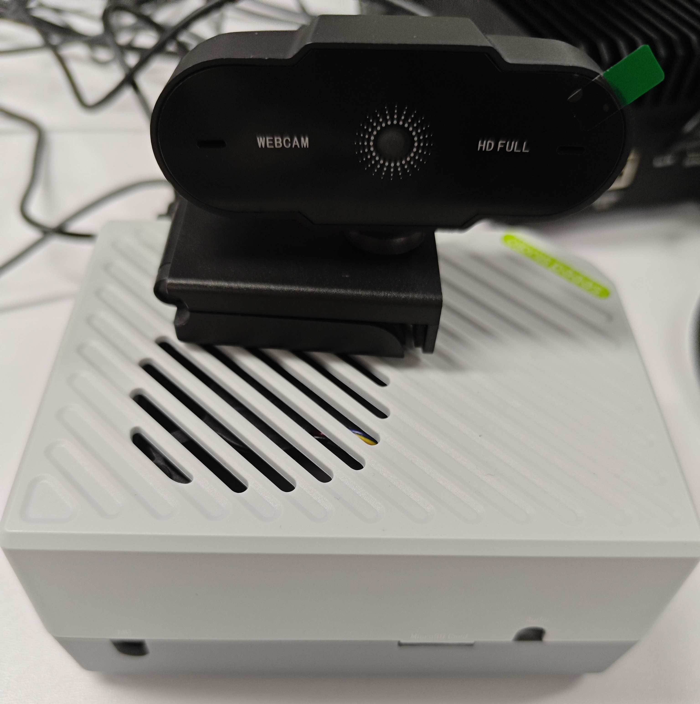
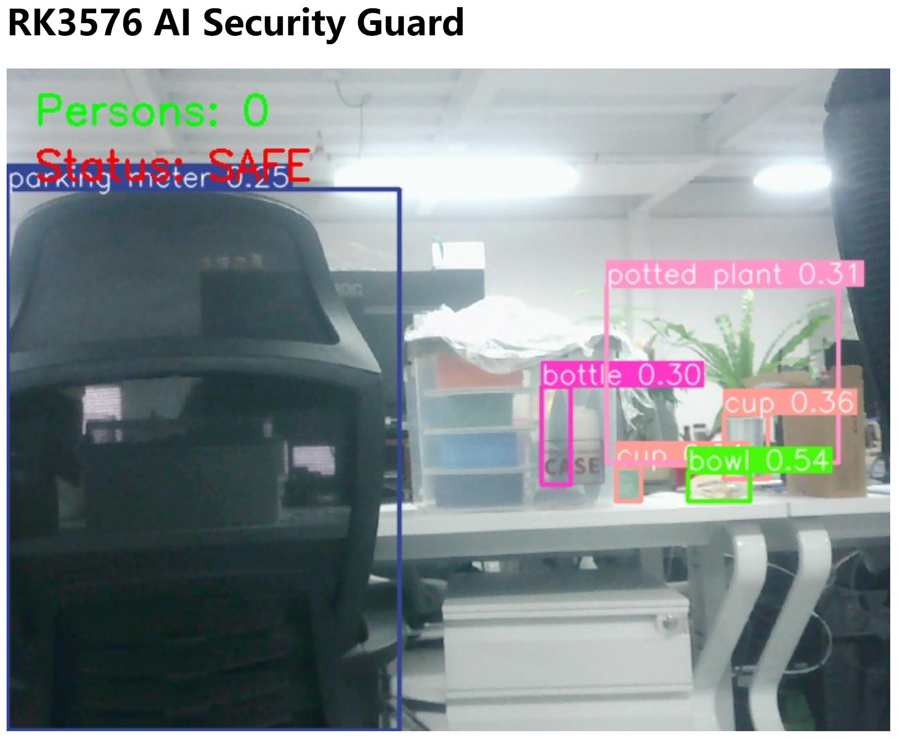
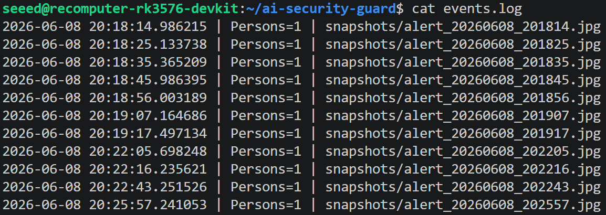

# AI Security Guard on reComputer RK3576

An edge AI security monitoring system running on Seeed Studio reComputer RK3576, featuring real-time person detection, automatic snapshot capture, event logging, and browser-based monitoring using YOLOv8.


## Overview

This project demonstrates a lightweight AI-powered security monitoring solution running entirely on the reComputer RK3576 AI Box.

Features:

* Real-time person detection
* Person counting
* Automatic intrusion snapshots
* Event logging
* Browser-based monitoring dashboard
* Fully local AI inference

## Hardware

* Seeed Studio reComputer RK3576
* USB Camera
* Network Connection

## Software

* Python 3.11
* YOLOv8
* OpenCV
* Flask

## System Architecture

USB Camera

↓

YOLOv8 Detection

↓

Person Counting

↓

Snapshot & Event Log

↓

Flask Dashboard

## Installation

Clone repository:

```bash
git clone https://github.com/inteintegrity/AI-Security-Guard-on-reComputer-RK3576.git

cd AI-Security-Guard-on-reComputer-RK3576
```

Create virtual environment:

```bash
python3 -m venv venv

source venv/bin/activate
```

Install dependencies:

```bash
pip install -r requirements.txt
```

Download YOLOv8 model:

```bash
python -c "from ultralytics import YOLO; YOLO('yolov8n.pt')"
```

## Run

```bash
python ai_web_demo.py
```

Open browser:

```text
http://RK3576_IP:5000
```

## Screenshots

### Detection Result



### Event Log



## Future Improvements

* Face Recognition
* MQTT Alert Notification
* Multi-Camera Support
* NPU Acceleration

## License

MIT License
